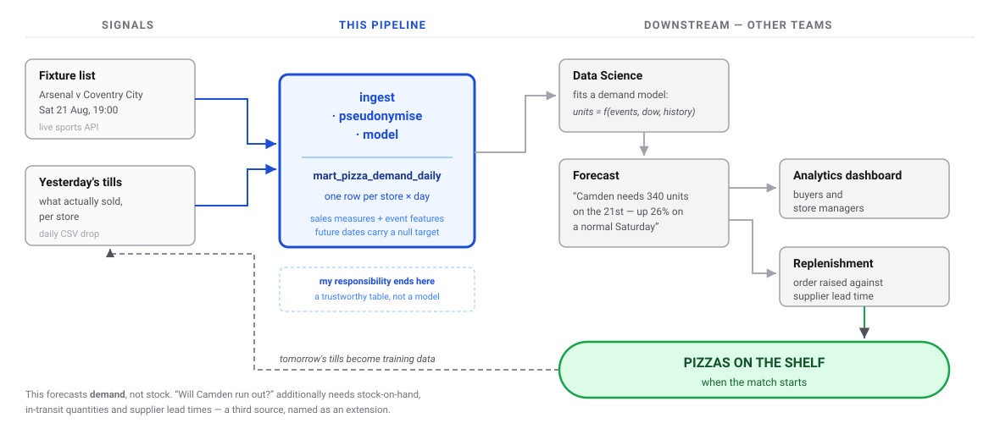
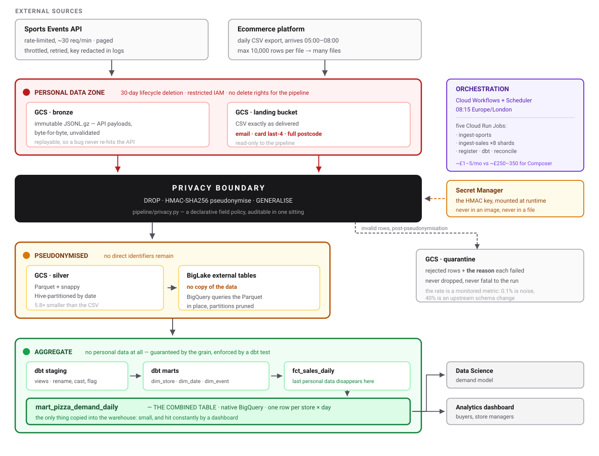
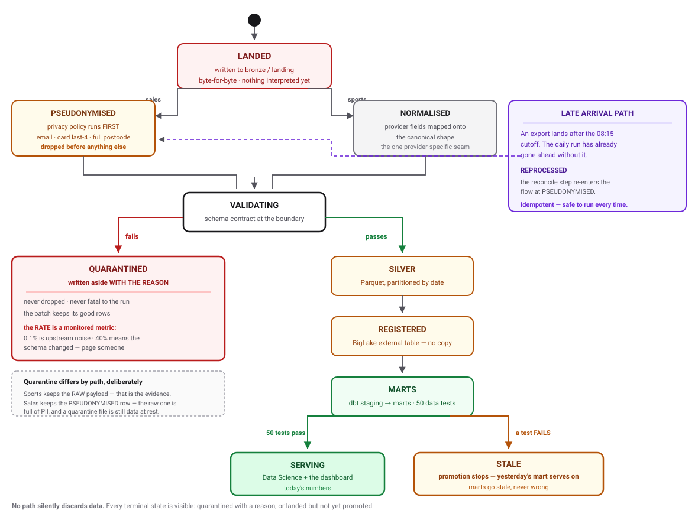
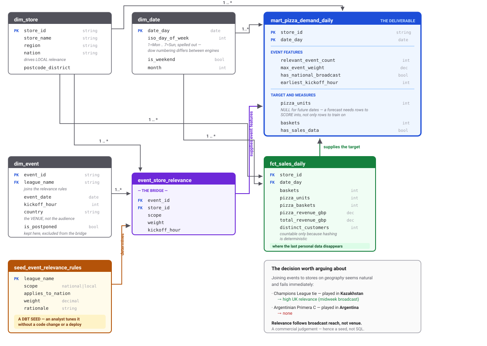

# Architecture

Six views, each answering a different question.

Four are drawn as **SVG** (in [`diagrams/`](diagrams)) — scalable, no rendering toolchain, and they drop
straight into a slide or a document. Two are **monospace text**, deliberately: a sequence ladder and a
class-with-method-list are what those diagrams look like anyway, and text keeps them diffable.

0. [From fixture to shelf](#0-from-fixture-to-shelf) — how this actually changes what a store stocks
1. [Containers and trust zones](#1-containers-and-trust-zones) — what runs where, and where personal data may exist
2. [Sequence of a daily run](#2-sequence-of-a-daily-run-uml) — what happens, in order *(UML)*
3. [A record&#39;s lifecycle](#3-a-records-lifecycle-uml-state) — every path a row can take, including the bad ones *(UML)*
4. [Components and boundaries](#4-components-and-boundaries-uml-class) — the abstractions and why they sit there *(UML)*
5. [Data model](#5-data-model-erd) — the warehouse schema *(ERD)*

---

## 0. From fixture to shelf

The engineering only matters if it changes what a store orders. This is the chain, and where my
responsibility starts and stops.



**What the pipeline is actually for.** Without it, the fixture list and the transaction history live in
different systems on different grains, so joining them is a spreadsheet exercise somebody redoes every
week. The pipeline makes *"what happens to pizza demand when there's a big match"* a queryable question
rather than a research project — daily, per store, automatically, reproducibly.

**Three honest boundaries**, worth stating before anyone assumes otherwise:

1. **This forecasts demand; it does not track stock.** The brief asks how many pizzas will be *needed*.
   Answering *"will Camden run out on Saturday?"* additionally requires stock-on-hand, in-transit
   quantities and supplier lead times — none of which this pipeline ingests. That is a named extension
   (a third source and an inventory dimension), not something quietly implied.
2. **The model belongs to the Data Science team.** I deliver the feature table; they fit and score. One
   design consequence is real though: the mart carries **future dates with a null target**, because a
   forecast needs rows to score into, not just rows to train on.
3. **The relevance weights are judgement, not fitted.** Which competitions matter, and how much, comes
   from a reviewable seed. Once there is enough history those weights should be *learned* — and this
   pipeline is what makes that possible.

---

## 1. Containers and trust zones

The trust zones matter as much as the boxes. Personal data exists **only** in the red zone, for at most
30 days. Everything past the privacy boundary is pseudonymised; everything past `fct_sales_daily` is
aggregate.



**Why the mart is native and everything else is external** (DECISIONS.md D4): bulk data stays as Parquet
on GCS, so there is one copy in an open format at object-storage prices. The serving table is tens of MB
and hit repeatedly by a dashboard, where native storage earns its keep. Making *everything* external
would trade real query performance on the hot path for savings measured in pennies.

---

## 2. Sequence of a daily run (UML)

The two ingestion branches are concurrent, and the run does **not** block on late files.

*Kept as text: a sequence ladder is legible in monospace, and this way a change to the run order shows up
as a readable diff.*

```
 Scheduler  Workflows   ingest-sports   Sports API   ingest-sales   GCS lake   BigQuery    dbt
     |          |             |              |            |            |          |         |
  1. |--trigger>|             |              |            |            |          |         |
     |  08:15   |     exports were promised by 08:00; we start once the window has closed   |
     |          |             |              |            |            |          |         |
     |     +----+------------------------- PARALLEL --------------------------+   |         |
     |     |    |             |              |            |            |      |   |         |
  2. |     |    |--start----->|              |            |            |      |   |         |
     |     |    | -7d .. +21d |              |            |            |      |   |         |
  3. |     |    |             |--GET-------->|   loop: one request per (date, sport),        |
     |     |    |             |  eventsday   |   throttled to 20 req/min    |      |         |
  4. |     |    |             |<--events-----|                              |      |         |
     |     |    |             |  or HTTP 429 |   429 -> honour Retry-After (capped at 60s),  |
     |     |    |             |              |   otherwise full-jitter backoff               |
  5. |     |    |             |--write bronze (immutable, unvalidated)--->|  |      |         |
  6. |     |    |             |  normalise -> validate -> deduplicate     |  |      |         |
  7. |     |    |             |--write silver Parquet-------------------->|  |      |         |
     |     |    |             |              |            |            |      |   |         |
  8. |     |    |--start, taskCount=8-------------------->|            |      |   |         |
     |     |    |             |     each shard takes every 8th export   |      |   |         |
     |     |    |             |     (CLOUD_RUN_TASK_INDEX)              |      |   |         |
  9. |     |    |             |              |            |<--read CSVs-|      |   |         |
 10. |     |    |             |              |   apply privacy policy, THEN validate         |
 11. |     |    |             |              |            |--write---->|      |   |         |
     |     |    |             |              |   silver Parquet + quarantine   |   |         |
     |     +----+----------------------------------------------------------+   |   |         |
     |          |             |              |            |            |          |         |
 12. |          |--register BigLake external tables------------------------------>|         |
     |          |   definitions only - moves no data                              |         |
     |          |             |              |            |            |          |         |
 13. |          |--dbt build --vars as_of_date=<logical date>------------------------------->|
 14. |          |             |              |            |            |<-staging -> marts--|
 15. |          |             |              |            |            |<-50 data tests-----|
     |          |    a failed test STOPS PROMOTION: marts go stale, never wrong             |
     |          |             |              |            |            |          |         |
 16. |          |--reconcile (runs regardless of any failure above)---->|          |         |
     |          |   reprocess exports that arrived after the cutoff;               |         |
     |          |   idempotent, so it is safe to run every time                    |         |
```

---

## 3. A record's lifecycle (UML state)

Every path a row can take. The point of the diagram is that **no path silently discards data** — the
terminal states other than "serving" are all visible: quarantined with a reason, or landed-but-not-yet-
promoted.



**Two branches worth defending.**

**QUARANTINED differs by path, deliberately.** Sports keeps the **raw provider payload**, because
normalisation is lossy exactly where validation fails — an unparseable timestamp becomes null, so the
normalised record preserves the symptom and discards the evidence. Sales keeps the **pseudonymised** row,
because the raw sales row is full of email addresses and a quarantine file is still data at rest. There is
an explicit test for this, because a well-meaning refactor "making the two paths consistent" would
silently start writing PII to disk.

**STALE is the important one.** When a data test fails, dbt does not promote, so the previous build keeps
serving. A dashboard showing yesterday's number is a problem someone notices and asks about; a dashboard
showing a *wrong* number today is a problem nobody notices until a stock order has been placed on it.

---

## 4. Components and boundaries (UML class)

The interfaces are deliberately small. Two protocols isolate the only genuinely environment-specific
concerns — where bytes live, and which SQL engine runs — so the same code runs on a laptop and on GCP.

*Kept as text: boxes with method lists is what a UML class diagram is, and the `<<Protocol>>` /
`implements` notation carries fine in monospace.*

```
 +------------------------------+
 | Settings         <<frozen>>  |     Read once, from the environment, by config.py -
 +------------------------------+     the only module that touches os.environ.
 | + target: str                |
 | + data_dir: str              |     Frozen because configuration changing mid-run is
 | + pseudonym_key: str         |     never intentional.
 | + bucket_lake: Optional[str] |
 | + is_gcp: bool               |
 +------+----------------+------+
        | selects        | selects
        | build_storage  | build_warehouse
        v                v
 +---------------------------+      +--------------------------------+
 | Storage      <<Protocol>> |      | Warehouse      <<Protocol>>    |
 +---------------------------+      +--------------------------------+
 | + write_bytes(path, data) |      | + register_silver() -> Dict    |
 | + read_bytes(path)        |      | + query(sql) -> List           |
 | + exists(path)            |      | + columns_of(table) -> List    |
 | + list_paths(prefix)      |      +-------+-----------------+------+
 +------+--------------+-----+              |                 |
        |              |             implements          implements
   implements     implements                |                 |
        |              |                    v                 v
        v              v          +------------------+  +----------------------+
 +--------------+ +-----------+   | DuckDBWarehouse  |  | BigQueryWarehouse    |
 | LocalStorage | |GCSStorage |   | views over       |  | BigLake external     |
 | filesystem;  | | lazy      |   | Parquet; the     |  | tables over the same |
 | temp-then-   | | client    |   | local stand-in   |  | GCS objects          |
 | rename write | | import    |   +------------------+  +----------------------+
 +--------------+ +-----------+

  NOTE  Four methods a filesystem and an object store can BOTH honour cheaply. Anything
        richer - renames, appends, directory semantics - does not map onto object storage
        and would leak a filesystem assumption into code that must run against GCS.

        Neither Warehouse implementation COPIES the data. That is what makes "lakehouse"
        a design rather than a word.


 INGESTION
 +------------------------+         +----------------------------+
 | HttpClient             |-------->| TokenBucket                |   throttled by
 +------------------------+  has-a  +----------------------------+
 | + get_json(url, params)|         | - tokens_per_second: float |
 | - _wait(attempt, hdr)  |         | - capacity: float          |
 +------------------------+         | + acquire(tokens) -> float |
   retries 429/5xx, caps            +----------------------------+
   Retry-After, full jitter,          clock and sleep INJECTED, so tests
   redacts the key before             drive a fake clock and never wait
   anything is logged

 +------------------------+         +----------------------------+
 | Source      <<frozen>> |-------->| FetchWindow   <<frozen>>   |   fans out over
 +------------------------+         +----------------------------+
 | + name: str            |         | + start_date: date         |
 | + path: str            |         | + end_date: date           |
 | + pagination: str      |         | + dates() -> List          |
 | + build_params(window) |         +----------------------------+
 +------------------------+
   Described as DATA, not code: adding a feed is one registry entry, not a new script.


 PRIVACY
 +--------------------------+        +------------------------------+
 | FieldPolicy  <<frozen>>  |------->| Pseudonymiser                |  HASH actions use
 +--------------------------+  uses  +------------------------------+
 | + field: str             |        | - key: bytes (Secret Manager)|
 | + action: str            |        | + pseudonymise(v) -> str|None|
 |   DROP|HASH|GENERALISE|  |        +------------------------------+
 |   KEEP                   |
 | + note: str      <-- the audit trail, not decoration
 | + output_name() -> str   |
 +--------------------------+

  NOTE  The policy tuple is the data-protection design AS DATA - readable and auditable
        in one sitting, rather than logic spread across three functions. docs/privacy.md
        generates its PII register from it, so the document cannot drift from the code
        that enforces it.
```

---

## 5. Data model (ERD)

A star schema, plus one wide denormalised table on top of it. The Data Science team gets the flat table
they actually want for feature engineering; anyone needing more depth has the dimensions underneath, so
the choice constrains nobody.



### The one modelling decision worth arguing about

`event_store_relevance` is the interesting model, and it exists because **the obvious approach is wrong**.
Joining events to stores on geography seems natural and fails immediately. The live data makes the point
better than an argument could:

| Fixture in the sample                                    | Venue         | UK relevance                                    |
| -------------------------------------------------------- | ------------- | ----------------------------------------------- |
| Kairat Almaty vs Levski Sofia*(UEFA Champions League)* | Kazakhstan    | **High** — midweek UK broadcast          |
| Cincinnati Bengals vs Detroit Lions*(NFL)*             | United States | **Moderate** — late-evening UK broadcast |
| Wolverhampton vs Blackburn*(Championship)*             | England       | **Moderate**                              |
| Argentinian Primera C fixture                            | Argentina     | **None**                                  |

A geographic join gets three of those four wrong. **Relevance follows broadcast reach, not venue
location** — which is a commercial judgement, not something derivable from the event feed. That is why it
lives in a reviewable seed an analyst can tune without a deployment (DECISIONS.md D8), and why
`dim_event.country` is explicitly labelled as the venue rather than the audience.
